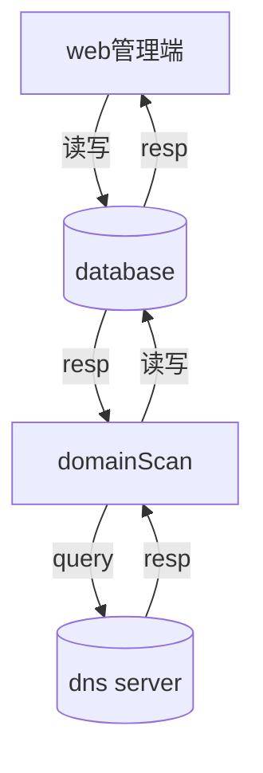

# 域名查询系统


## 功能

查询域名对应的IP地址信息， 并保存到数据库


### web 端功能 

- 域名查询
- 添加新域名


### domainScan

- 域名解析


## 项目目录

```
.
├── admin                   # 域名查询 web 端
├── backend                 # 域名解析端 domainScan
├── db                      # 数据库
├── docker-compose.yaml 
└── README.md

```

## 部署与使用

### 部署

```
# 未完成
$ docker-compose up -d
```

### 


### 使用

通过 web 端使用, 访问  http://ip:80/


### 停止

```
# 未完成
$ docker-compose down
```


## 流程

数据流程图


