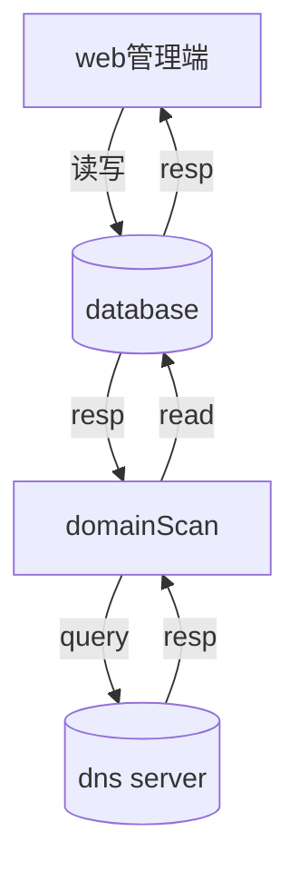

# 域名查询系统

## 功能

查询域名对应的IP地址信息， 并保存到数据库

### web 端功能 

- 域名查询
- 添加新域名


### domainscan

- 域名解析


## 使用


### 运行

```
root @ c7 in ~/.../NameAdmin/admin |15:40:43  |master U:6 ?:1 ✗|
$ go run .

2021/12/30 15:44:23 /root/go/pkg/mod/gorm.io/driver/sqlite@v1.2.6/migrator.go:32
[0.062ms] [rows:-] SELECT count(*) FROM sqlite_master WHERE type='table' AND name="domains"

2021/12/30 15:44:23 /root/project/go/NameAdmin/admin/main.go:57
[0.020ms] [rows:-] SELECT * FROM `domains` LIMIT 1

2021/12/30 15:44:23 /root/go/pkg/mod/gorm.io/driver/sqlite@v1.2.6/migrator.go:257
[0.024ms] [rows:-] SELECT count(*) FROM sqlite_master WHERE type = "index" AND tbl_name = "domains" AND name = "idx_domains_deleted_at"

2021/12/30 15:44:23 /root/go/pkg/mod/gorm.io/driver/sqlite@v1.2.6/migrator.go:32
[0.014ms] [rows:-] SELECT count(*) FROM sqlite_master WHERE type='table' AND name="ip_addrs"

2021/12/30 15:44:23 /root/project/go/NameAdmin/admin/main.go:57
[0.013ms] [rows:-] SELECT * FROM `ip_addrs` LIMIT 1

2021/12/30 15:44:23 /root/go/pkg/mod/gorm.io/driver/sqlite@v1.2.6/migrator.go:186
[0.020ms] [rows:-] SELECT count(*) FROM sqlite_master WHERE type = "table" AND tbl_name = "ip_addrs" AND (sql LIKE "%CONSTRAINT \"fk_domains_ip_addrs\" %" OR sql LIKE "%CONSTRAINT fk_domains_ip_addrs %" OR sql LIKE "%CONSTRAINT `fk_domains_ip_addrs`%")

2021/12/30 15:44:23 /root/go/pkg/mod/gorm.io/driver/sqlite@v1.2.6/migrator.go:257
[0.013ms] [rows:-] SELECT count(*) FROM sqlite_master WHERE type = "index" AND tbl_name = "ip_addrs" AND name = "idx_ip_addrs_deleted_at"
[GIN-debug] [WARNING] Creating an Engine instance with the Logger and Recovery middleware already attached.

[GIN-debug] [WARNING] Running in "debug" mode. Switch to "release" mode in production.
 - using env:   export GIN_MODE=release
 - using code:  gin.SetMode(gin.ReleaseMode)

[GIN-debug] GET    /                         --> main.GetIndex (4 handlers)
[GIN-debug] GET    /domain                   --> main.GetDomain (4 handlers)
[GIN-debug] POST   /domain                   --> main.AddDomain (4 handlers)
[GIN-debug] [WARNING] You trusted all proxies, this is NOT safe. We recommend you to set a value.
Please check https://pkg.go.dev/github.com/gin-gonic/gin#readme-don-t-trust-all-proxies for details.
[GIN-debug] Listening and serving HTTP on :8888
2021/12/30 15:45:01 add domain name: bgvji.com

2021/12/30 15:45:01 /root/project/go/NameAdmin/admin/main.go:177


```

### 访问 

通过 web 端使用, 访问  http://ip:80/


## 流程

数据流程图


