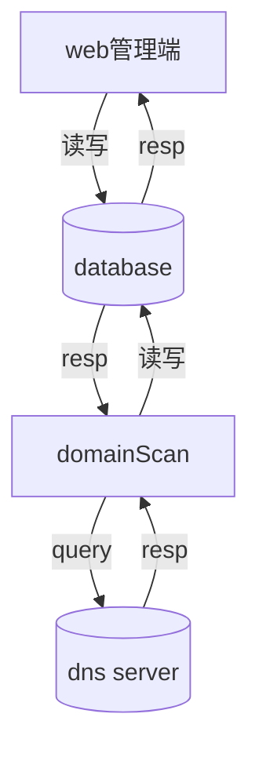

# 域名爬虫


## 功能

获取数据库中域名, 并解析库对应的 IP， 保存到数据库中。


## 使用

### 运行

```
root @ c7 in ~/.../NameAdmin/backend |15:41:44  |master U:6 ?:1 ✗|
$ go run .

2021/12/30 15:41:49 /root/project/go/NameAdmin/backend/main.go:51
[0.274ms] [rows:0] SELECT * FROM `domains` WHERE `domains`.`deleted_at` IS NULL
root @ c7 in ~/.../NameAdmin/backend |15:41:49  |master U:6 ?:1 ✗|
$ go run .

2021/12/30 15:43:33 /root/project/go/NameAdmin/backend/main.go:51
[0.266ms] [rows:0] SELECT * FROM `domains` WHERE `domains`.`deleted_at` IS NULL
2021/12/30 15:43:33 解析域名完成.
root @ c7 in ~/.../NameAdmin/backend |15:43:33  |master U:6 ?:1 ✗|
$ go run .

2021/12/30 15:46:33 /root/project/go/NameAdmin/backend/main.go:51
[0.411ms] [rows:21] SELECT * FROM `domains` WHERE `domains`.`deleted_at` IS NULL
2021/12/30 15:46:33 查询域名失败:  bgvji.com
2021/12/30 15:46:36 查询域名失败:  ervqimmtc.com
2021/12/30 15:46:40 查询域名失败:  mpwkhhyojr.com
2021/12/30 15:46:43 查询域名失败:  ceysiqifb.com

```


## 流程

数据流程图


